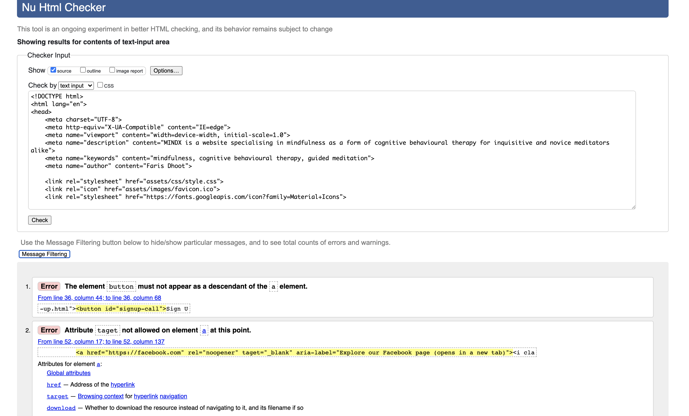
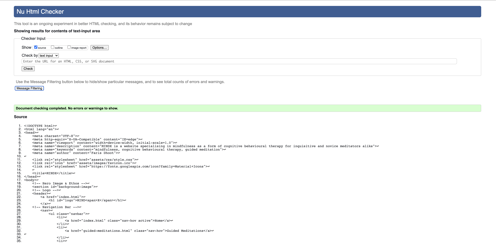
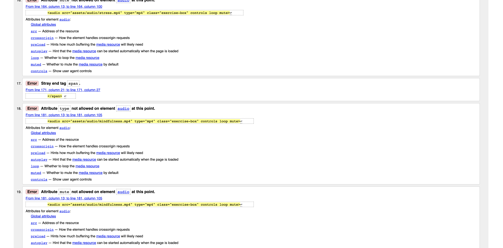
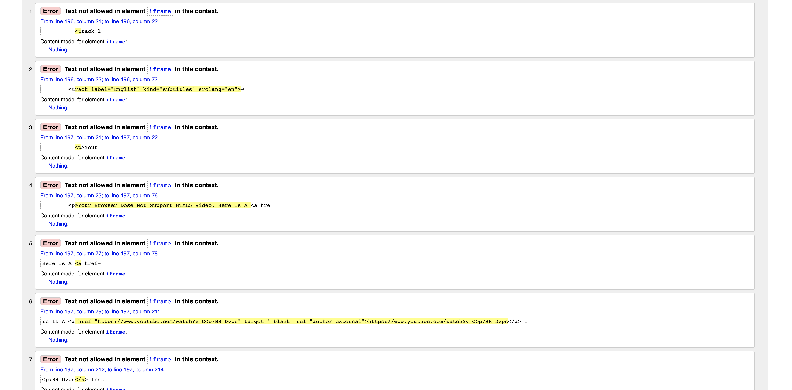
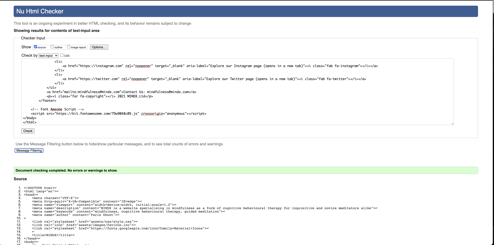
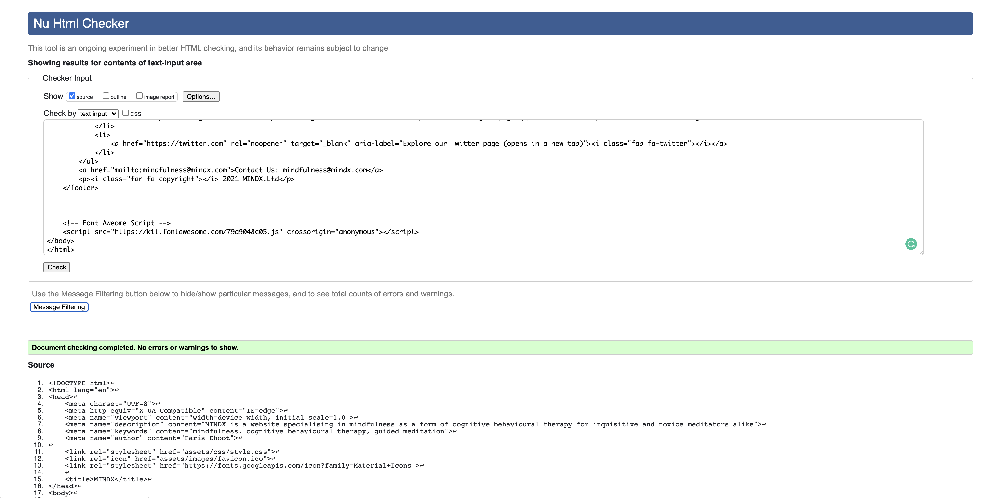
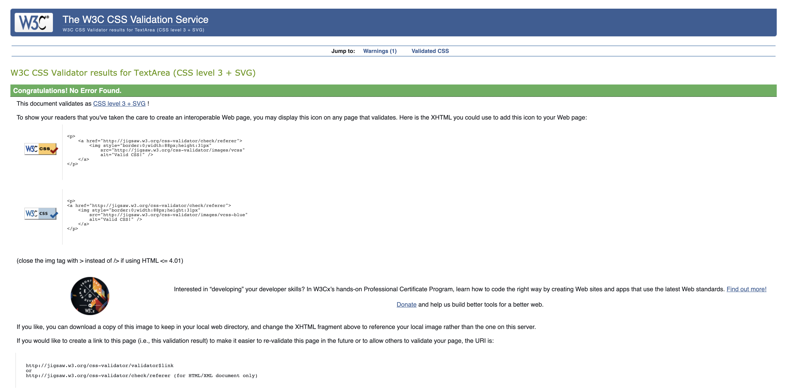

# MIND**X**

[View Live Website Here]( https://farisgjd.github.io/mindx/)

# Table Of Contents

1. [Introduction](#introduction)
2. [User Experience](#user-experience)
    * [Site & User Goals](#site-&-user-goals)
    * [User Stories](#user-stories)    
3. [Development Planes](#development-planes) 
    * [Strategy](#strategy)
    * [Scope](#scope)
    * [Structure](#structure)
    * [Skeleton](#skeleton)
    * [Surface](#surface)
4. [Technologies Used](#tech-used)
5. [Search Engine Optimization](#seo)
6. [Bugs](#bugs)
7. [Testing](#testing)
8. [Validation](#validation)
9. [Deployment](#deployment)
10. [Credits](#credits)
11. [Acknowledgements](#aknowledgements)

***
# Introduction

Mental disorder is the leading cause of morbidity worldwide making it an accrescent field of interest within the medical and public spheres. Recognition of an individual’s psychological state as homogeneously significant to their physical is paramount to their overall wellbeing. This is especially true in the current climate. The impact of the Corona Virus has exponentially increased rates of mental health issues worldwide limiting the accessibility of medical services. Barriers in delivering traditional therapies have led individuals towards the pursuit of holistic solutions for their ailments such as meditation.

 MIND**X** or MINDX*ercise* is an online platform providing simple body/mind self-improvement techniques to inquisitive and novice meditators alike. Its ethos is based around the teachings of mindfulness ~ to live in the present. Its mission is to improve the overall wellbeing of an individual through visual and voiceover guided meditations. Studies show that as lockdown eases world over the demand for simple everyday meditative exercises is on the rise.

MIND**X** uses the philosophies underpinning mindfulness as a Cognitive Behavioural Therapy (CBT) which is a studied, proven and effective treatment for mental health illnesses. By design MIND**X** increases the accessibility of therapies to larger more diverse audiences when compared to clinical settings. It is unique as it focuses on mindfulness coupled with CBT to create Mindfulness-Based Cognitive Therapy (MBCT) which is unheard of in the market place.

[Back To Top](#mindx)

***
# User Experience 
## Site & User Goals 
### Site Goals
-	Help individuals improve their overall wellbeing, specifically mental health.
-	Teach users the fundamentals of mindfulness through video and voiceover guided meditations.
-	Produce a minimalistic, intuitive, accessible and interactive website in terms of navigation, content and convenience. 
-	Enable users to sign up for an account. 
-	Develop a core client base for future updates and releases.
### User Goals 
-	Alleviate ailments associated with sporadic or chronic mental health disorders.
-	Establish and maintain daily meditative practices.
-	Access exercises while at home or on the go.

## User Stories 
### First Time Visitor Goals 
1.	As a First Time Visitor, I want to instantly understand the main purpose of the site so that I learn more about the organisation. 
2.	As a First Time Visitor, I want an intuitive navigational experience so that I can easily find content. 
3.	As a First Time Visitor, I want access to social media links to get a wider view of the organisation as to determine their legitimacy. 
### Returning Visitor Goals 
1.	As a Returning Visitor, I want to access video/voice over lessons to improve my wellness.
2.	As a Returning Visitor, I want to compare the sites offerings to competitors so that I can ascertain their unique selling proposition. 
3.	As a Returning Visitor, I want to find the organisations contact details for any questions I have regarding their exercises  
### Frequent User Goals 
1.	As a Frequent User, I want to conveniently access the lessons that apply to my ailments the most. 
2.	As a Frequent User, I want to check if there are any newly added guided meditations.
3.	As a Frequent User, I want to sign up for an account so that I can access more features, newsletters and am emailed about major updates, launches or changes to the website. 

[Back To Top](#mindx)

***
# Development Planes 
## Strategy
The overarching strategy behind MIND**X** is to teach users the fundamental principles of mindfulness as a form of CBT. This is in a bid to improve their overall wellbeing and as a result develop and increase a client base for future releases. 

MIND**X** will focus on the following user attributes acquired from various cross-sectional clinical studies regarding meditative app usage: 

**Demographics**
-	Ages 18 – 65
-	All genders (mainly females)
-	All ethnicities and religions 
-	Suffering with a mental illness mainly: anxiety, depression, stress & sleep disorders 
-	Suffering with physical health issues mainly: high blood pressure, chronic pain, cancer & diabetes 
-	Tech literate and illiterate 

**Psychographics** 
-	Active interest in meditation 
-	Novice meditators
-	Eager to learn new things 
-	Health conscious 
-	Fitness lovers 
-	Looking for lifestyle changes
-	Avoidance coping 

The website *needs* to enable the **User** to: 
-	Find information regarding mindfulness & meditation 
-	Correlate mindfulness as a form of CBT 
-	Easily access video/voice over content 
-	Create an account

The website *needs* to enable the **Client** to: 
-	Develop an online presence by creating a custom website. 
-	Cultivate and increase client base through unique offerings.
-	Showcase a variety of guided meditations.
-	Encourage users to create an online account. 
-	Have a high level of accessibility. 

**Trade-off Equation: Importance VS Viability/Feasibility**

A trade-off analysis was conducted to rank opportunities based on user needs and business objectivise. Projections are scored in terms of their importance versus their viability/feasibility. The scatter graph shows that 4 out of 5 possibilities can and should be implemented. Accessibility is an issue as MIND**X** is currently web based. It is industry standard for organisations to be both web and app-based meaning MIND**X** needs to be as responsive on different devices as possible. 

[Back To Top](#mindx)

***
# Scope
The initial public offering or phase one of MIND**X** release strategy is to build an intuitive **Minimal Viable Product** in regards to content, design, accessibility and interactivity. A scope was defined through an agile methodology based off of the strategy and broken down into content requirements and functional specifications. 

**Content Requirements:**
-	Visual iconography relating to mindfulness, meditation and the wider topics surrounding the subject.
-	MIND**X** ethos.
-	MBCT.
-	Minimum of four (5 – 15 min) meditative exercises, must include:
    * Breathing.
    * Sitting. 
    * CBT meditations.
    * Sleeping. 
-	Minimal design.
-	Call to action and signup form. 
-	Contact information. 
-	Links to social media account.

**Functional Specifications:**
-	Speedy loading of the website and its content.  
-	Simple and easy navigation. 
-	Interactive design. 
-	Fully functioning video/audio lessons. 
-	Active social media links. 
-	Operative signup form. 
-	Accessible on a range of devices. 
-	Search Engine Optimisation. 

[Back To Top](#mindx)

***
# Structure
MIND**X**'s highest priority is to teach users body/mind self-improvement techniques, therefore simple and intuitive access to said techniques is of upmost importance. A hierarchical tree structure is used to organise the website as it reduces complexity, creating a linear narrative. Even though tree structures pose issues in regards to mobile devices, methods have been implemented to remedy this such as a high level of responsiveness.

Even though the site is currently a minimal viable product meaning a modest amount of information, three separate pages are needed for future manageability. MINDX has specific content (helpful articles, games & downloadable items) it needs to add to each section. Furthermore this design deliberately follows the teachings of mindfulness ~ living in the present as to make each page unique and the primary focus for the user. 

index.html:
-	Header – introduces MIND**X** official logo and familiarises the user with the site’s navigational planes, leveraging their prior experience. 
-	Background Image & Ethos – reinforces the identity of the website and creates and eye-catching landing page.  
-	Footer – provides social media and contact details so that when the user concludes they can get in contact.  

guided-meditation.html:
-	Header – keeps the site consistent, offers another call to action & provides easy navigation (e.g., sticky header).  
-	Intro To MINDX & MBCT – creates brand awareness and begins to address user stories, as well as introduces the key concepts of the brand (USP). 
-	Mindfulness Meditations 1 – 4 – most important and visited part of the website, lessons build on each other in terms of relevance and difficulty making the next exercise easier. 
-	Footer – again keeps the site consistent creating familiarity. 

sign-up.html:
-	Header – creates uniformity and establishes conventions. 
-	Call To Action Signup Form – allows users to create an account with MINDX in a bid to develop a core client base.  
-	Interactive Image – creates interest around the page whilst strengthening the brand. 
-	Footer – gives another opportunity to get in touch and explore.   

[Back To Top](#mindx)

***
# Skeleton 
Wireframes were created using Balsamic to determine the basic navigation and interface design of the site. It is important to give form to function meaning the meditative lessons need to speak for themselves. A minimalistic design in terms of navigation and content is employed accompanied by engaging images and key text. Market leading competitors such as Headspace, Calm & Brainfm have adopted similar methodologies so it is important to leverage user’s prior experience. The site will utilise progressive disclosure which is especially important when learning meditation as this is deemed the best way an individual can absorb and turn meditation into a habit. 

**Balsamic Wireframe:**

  

  

  

  

  

  

  

  

[Back To Top](#mindx)

***
# Surface

## Colour Scheme  
The colour story behind MIN**X** was inspired from the background image used on the Home page; a peach (#f1c2b0) background leads with accents of “brain pink” (#f7756f) to complement. White (#ffffff) was later injected to provide a dynamic colour scheme. Finally light blue (#468C98) was introduced on the Sign-Up page as a kind of tease for future releases and colour story. 

## Typography
Three different fonts are used throughout the website for different connotations, creating a strong font design. The two main pairings are Raleway and Roboto which are both sans-serif fonts that complement each other. Both have an extensive font family meaning they have a variety of thin and bold choices giving a good contrast. For example, Raleway (900 weight) is used for the logo, ethos and main headings, capturing the user’s attention while Roboto (300 weight) is used for the body text as the letter form works well together. Oswald (500 weight) another sans-serif font is used solely for the navigation items as to make the stand out from the rest of the information.

## Imagery
The images used in MIND**X** are connected to the field on mindfulness and the wider topics surrounding it. The landing page uses a high-fidelity image of a brain meant to immediately capture the user’s attention. Ideally the remaining images would have been the same quality but due to resource constraints icons were used. This said text-shadows were used to tie the image together as to be cohesive. 

## Features
**Header**
 -	Logo – introduces MIND**X** identity and initiates the user’s discovery phase where they begin to ask questions about the brand.
-	Navigation Links – facilitates the user’s exploration of the site through three clearly defined sections. 
-	Call To Action – gives users visual que to sign up to MIND**X** increasing client base and informing them about future releases.  

**Footer**
-	Social Media Links – allows users to view MIND**X** as a whole outside of the context of the web app. 
-	Contact Information – permits users to contact MIND**X** for any questions relating to the exercises or general information. 
-	Copyright – protects MINDX intellectual property. 

**index.html** 
-	Background Image – an impactful and eye-catching image welcoming the user to the site and teasing what is ahead.
-	Ethos – text accompanying the background image, reinforcing what MIND**X** is about and what the user should expect moving forward. 

**guided-meditations.html**
•	Guided Meditation Introduction – defines the founding concepts that make MIND**X** unique such as mindfulness, MBCT and guided meditations that work their way up in difficulty and applicability. 

•	Exercises – ten guided exercises that are comprised of a title, introductory paragraph, video/audio exercise and an image. This type of progressive disclosure is used to give a brief overview of what each exercise is before engaging with the actual instructional meditation. This allows the user to access their most relevant exercises for their specific needs. 

**sign-up.html** 
-	Signup Form – gives users the chance to sign up to MINDX increasing client base and updating them about future releases.  

-	Interactive Image – familiarises users with what they should expect for future releases. MINDX will make more interactive interactions. 

## Features To Implement
-	Useful Articles – links to external peer reviewed papers and official bodies relating to the wider topics surrounding the field. 
-	Inspirational Quotes – a random inspirational quote generator. 
-	Colouring Pages – downloadable mindful colour pages used for relaxation and focus. 
-	Games – mindful and meditative games which would increase and sustain site traffic. 

[Back To Top](#mindx)

***
# Technologies Used 
-	HTML5 – programming language to create basic site structure.   
-	CSS3 (Flex & Grid) – programming language to add styling to site. 
-	Google Fonts – typography & icons import.
-	Font Awesome – icons import.
-	Adobe Colour Wheel – colour pallet generator.
-	Coolors – colour pallet generator. 
-	GitHub – cloud based hosting service, managing repositories. 
-	GitPod – integrated development environment used to develop project. 
-	Git – version control tool. 
-	Git Large File Storage – used to store files that are too large for GitPod, improving performance. 
-	GitHub Pages – used to deploy website. 
-	Google Chrome Developer Tools – used for debugging.  
-	Lighthouse – website performance review. 
-	JPEG Optimiser – image condenser.
-	Balsamic – wireframes. 
-	Web Formatter – formatting HTML & CSS code.
-	Google Search Console – search engine optimization. 
-	XML Sitemaps – search engine optimization. 
-	Youtube2mp3 Converter – convert YouTube videos into audio. 
-	Favicon – used to create favicon. 

[Back To Top](#mindx)

***
# Search Engine Optimization
Search Engine Optimisation techniques have been implemented, improving the quality and quantity of website traffic to MINDX from search engines.  
-	Meta Description and Keyword tags have been used in the head of each page, fostering better relationships between MINX and search engines. 
-	Crawlable Links. 
-	Google Search Console and XML Sitemap creating better understating between the site and search engines.

[Back To Top](#mindx)

***
# Bugs & Issues
-	The background image had extremely slow loading times due to two determined factors. The first being the file size which was compressed using online tools. The second was the use of absolute file paths which had incompatibility issues with GitHub Pages so a relative path was used instead. 
-	 The icons used had a predefined maximum font size (48px) which was smaller than preferred so the !important rule was called to overcome this. 
-	Text shadow of white were used on each letter of the logo and ethos which proved to be problematic when the font reaches a certain size so it was removed. 
-	Guided meditations file size was too large for GitPod to host, so Git Large File Storage was used to do so. 

[Back To Top](#mindx)

***
# Testing 
Each section was tested for responsiveness during and after completion of the site. To do this Google Chrome Developer Tools was used to inspect functionality by examining the site through various predefined device breakpoints as well as overall responsiveness.  Below are examples of what each section was tested for: 

**Header** 
-	Logo redirects to home page. 
-	Links forward to corresponding pages.
-	Active links signifier responds to correct pages. 
-	Call to action sign up button hover effect works. 

**Footer** 
-	Social media links redirect in a new tab to corresponding pages as well as aria-labels being read correctly.
-	Contact email address, when clicked opens the users preferred mailing software. 

**index.html**
-	Background image loads quickly without loss of quality. 
-	Lock icon loads instead of and before predefined text alternative (lock_open) as well as screen readers not reading out text alternative by using aria-hidden attribute. 

**guided-meditations.html**
-	Sticky header works and fits the space between each exercise so that the user can access it.
-	The right aligned paragraph loads to the correct side. 
-	Aria-hidden attributes for icons work on screen readers as to not confuse or waste impaired user’s time. 
-	Each video/audio exercise loads and can be accessed immediately.
-	Each exercise has controls is muted, loops and is responsive. 

**sign-up.html**
-	Signup form button responds to hover animation. 
-	Interactive eye responds to hover and aria-hidden operates. 

## Device Testing 
To make the site responsive the max-width attribute was used to create popular breakpoints ranging from 1200px – 280px. This said since MINDX implements a garish design in terms of text and image size, creating the site desktop first proved to cause issues in terms of responsiveness. This is because much of the text and icons were programmed at capacity meaning new breakpoints (rather than the pre-defined norm) needed to be added as to function appropriately on different device sizes. 

For example, the home page ethos needed a different font size at nearly every new and predefined breakpoint. Furthermore, as the ethos used a display of absolute to position itself, precision was also an issue; if the screen size deviated slightly the text would overlap with other elements. This meant that its position or top and bottom “coordinates” needed to be adjusted accordingly. 
The guided meditation exercises also needed tweaking since they used a display grid to position themselves. This meant that the traditional method of responsiveness (box-model) wouldn’t predominantly apply and that specific grid templates needed to be used instead. For example, at the 1024 px breakpoint the grid display needed to be changed from a row into a column. 

Finally, the signup page interactive eye used a position of absolute similar to the ethos which meant responsiveness was an issue at the 480px breakpoint. Part of the animation would stretch over its whole column which meant it had to be removed which solved the issue. 

## Browser Testing 
The site was tested on the following browsers to check for compatibility: 

-	Firefox
-	Chrome
-	Safari

All browsers had no issues except for Safari with absolutely positioned element. This was remedied by changing respective font sizes and positions as mentioned previously. 

## Peer Review Testing 
Family members and colleagues (through slack) were asked to access the project through various means. The feedback was: 
-	Safari had issues with ethos and interactive eye which was determined to be their absolute positioning. 
-	The navigation links that used a line-height property to align themselves with the logo. This was causing issues with the “pseudo” button (see validation) to be larger than desired. This was remedied by using a margin-top to align instead.
-	The footer links were not opening on a new page on Firefox due to a spelling mistake on the target=”_blank” attribute and value pair. 

## User Stories Testing 
As a First Time Visitor: 
1.	When loading the site, the user is greeted with a background image accompanied by the ethos. When combined both give a succinct view of MINDX and its offerings – brain image and “exercise your mind” alludes to a site that focuses of mind training.  
2.	The navigation bar is titled in a way that explains its purpose (e.g., Guided Meditations meaning exercises) as well as leveraging the users prior experience with tree structured sites. 
3.	The footer is located on every page giving the user ample opportunity to determine the sites legitimacy through a “compare and contrast” evaluation. 

As a Returning Visitor: 
1.	Video and voice over lessons use a grid system accompanied by text and images to clearly show the user what each stands for. Furthermore, the exercises utilise Git Large File Storage meaning they load and can be accessed quickly. 
2.	Again, the site utilises a tree structure meaning each page is the focus to the user. When comparing MINDX offerings to competitors the user has no distractions and can do so comfortably. 
3.	Contact email is embedded in every page and uses the mailto attribute which opens the users preferred mailing software. 

As a Frequent User: 
1.	The site is highly accessible in terms of device and optimisation meaning the user can access their preferred exercise wherever and whenever they please. 
2.	The user can sign up to MINDX where they will be informed about any newly added guided meditations, features, newsletters and updates. 

[Back To Top](#mindx)

***

# Validation 
The code was put through online validation and responsiveness tools to determine its competences. The tools used were: 

## HTML Validator
**Home Page**

The home page had a few errors as seen below. The first was a button being nested inside an anchor tag which was recitifed by removing the button tag an creating a button style in CSS. The second issue was a spelling mistake which was also addressed. 

 

 

**Guided Meditation Page** 

The guided meidtations page has errors as seen below. The first was an inncorect type attribute and value pair given to each audio tag. The second and third were spelling mistake and stray closing tags. The last was the iframes having unaplicable attributes aswell as content intended for accesibility between the opening and closing tag not being allowed. 

 

 

 

 

**Sign Up Page** 

The signup pages errors consisted of stray tags as seen below. 

## CSS Validator 
The CSS code returned with no errors or warnings. 

## Google Mobile-Freindly Test 
Goolgle mobile freindly results came back as positive as seen below. 

## Lighthouse 
Lighthouse was used to test and improve the quality of MINDX. From its results accessibility needed addressing as the signup button was deemed to have average contrast. This said through various testing parameters this was deemed to be inaccurate and was left as is. Finally, performance was also an issue as the background image loading time was a second or two longer than desired. This was also left as is since compressing the image further would cause distortion meaning an opportunity cost was made. 

[Back To Top](#mindx)

***
# Deployment
The code for this project was created, edited and previewed on GitPod, a cloud-based IDE. Git was used as a version control tool to push the code into a premade GitHub repository which hosts the workspace and project. The project is subsequently deployed using GitHub Pages. The process to do so is as follows:
1.	Locate the relevant GitHub repository.
2.	In the tab below the repository name click settings where you will be redirected to a new page. 
3.	The tab on the right-hand side contains several options, the desired is pages. 
4.	In the source section choose master from the first drop-down menu titled branch, then root from the second drop-down menu with a folder icon and finally save. 
5.	Once the process is complete the live URL will be displayed above with the text “Your site is published at”. 

Successively this code can be cloned or forked from the same GitHub repository. 

## Repository Forking 
Forking a repository simply means creating a copy of the original to be viewed and edited without effecting the source. To do so: 
1.	In GitHub locate the relevant repository. 
2.	In the top right-hand side, underneath the user icon click the fork button. 
3.	The forked repository should load and save to the GitHub account it was created on. 

## Repository Cloning 
GitHub repositories exist remotely online. Cloning a repository means you create a local copy on your computer and sync between the two locations. To do so: 
1.	Navigate to the main page of the desired repository. 
2.	Above the list of files click on the green code button. 
3.	You will be given the option to clone with HTTPS, SSH & GitHub CLI, chose the desired option, in this case desktop is where the clone will be housed. 
4.	Finally follow the prompts in GitHub desktop to complete the process. 

[Back To Top](#mindx)

***
# Credit 

Information regarding the content of the website and any statistics or claims mentioned are sourced from: 
-	Wikipedia – mindfulness. 
-	Wikipedia – mindful-based-cognitive-therapy. 
-	NHS – cognitive behavioural therapy. 
-	NHS – mindfulness  
-	Headspace – guided meditations
-	JMIR Publications – characteristics and usage patterns among 1251 paid subscribers of the calm meditation app: cross sectional survey. 
-	BMC Research – effectiveness of using a meditation app in reducing anxiety and improving well-being during the COVID-19 pandemic.

Guided meditations were taken from YouTube and converted into audio or imbedded as videos. The source for each exercise is: 
-	Epworth Health Care (Breathing) 
-	MyLife (Body Scan)
-	Mark Williams (Sitting)
-	Great Meditation (Sleep)
-	Goodful (Start The Day, Anxiety & Depression) 
-	Headspace (Stress) 
-	The Honest Guys (Mindfulness) 
-	Jessica Richburg (Yoga) 

Code for the interactive eye on hover was taken and modified/customised from YouTube: 
-	Dark Code

General code help, inspiration and resources: 
-	Love Running Walkthrough Project 
-	W3S
-	CSS-Tricks
-	Stack Overflow 
-	Free Code Camp 
-	Web Dev Simplified (YouTube)
-	Dev Ed (YouTube) 
-	Kevin Powell (YouTube) 
-	Easy Tutorials (YouTube) 

[Back To Top](#mindx)

***
# Acknowledgements
I would like to thank my mentor and the slack community for helping me throughout this process. A special thank you goes to the student care team who have accommodated my special circumstances.  